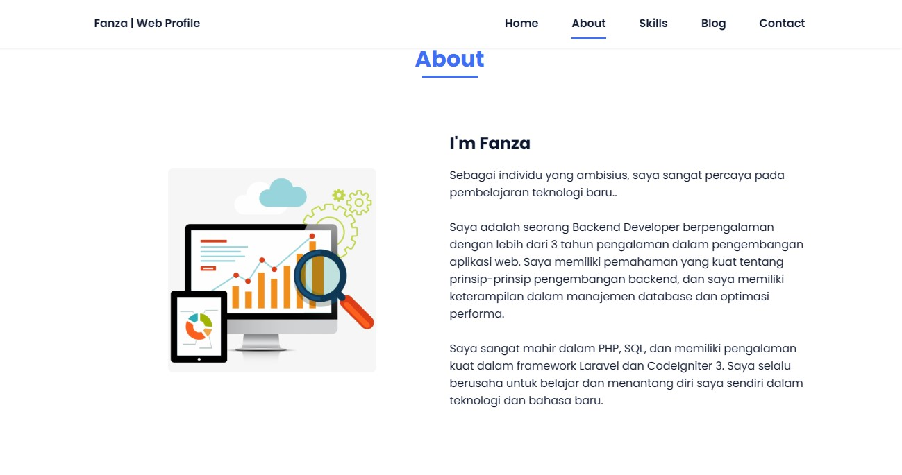
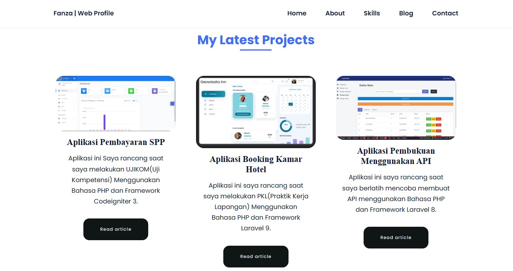
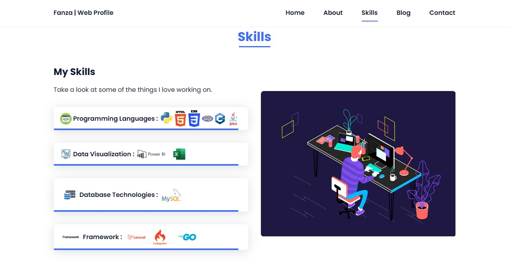
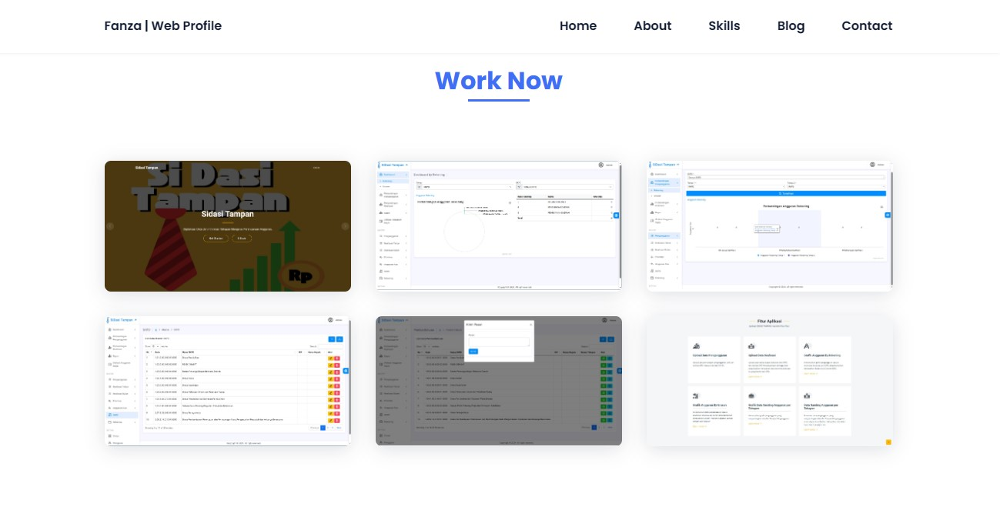

<h1 align="center">
    <a href="https://amplication.com/#gh-light-mode-only">
    
    </a>
</h1>

<p align="center">
  <i align="center">Instantly generate production-ready HTML apps 🚀</i>
</p>

<h4 align="center">
  <a href="https://github.com/Shreejan-35/Classified"></a>
  <a href="https://github.com/Shreejan-35/Classified"></a>
  <a href="https://github.com/Shreejan-35/Classified"></a>
  <a href="https://github.com/Shreejan-35/Classified"></a>
</h4>


<p align="center">
    
</p>

## Introduction

`Fanza | Web Profile` is a website that explains about the creator of this website.  This Web Profile explains the Skills of the creator, the work he is currently doing, and the experiences that have been made by the creator of this Web Profile.  You can see the results of the projects that have been designed by the creator by directing to the blog page, then click **See Article**.

<details open>
<summary>
 Features
</summary> <br />

<p align="center">
    
&nbsp;
    
</p>

<p align="center">
    
&nbsp;
    
</p> 

</details>

## Usage

To get started with this Github Pages, the hosted version of the product can be used. You can get started immediately at [Fanza | Web Profile](https://Fanzaatsila.github.io).

<details>
<summary>
  Tutorials
</summary> <br />

</details>

## Development

Alternatively, instead of using the hosted version of the product, Amplication can be run locally for code generation purposes or contributions - if so, please refer to our [contributing](#contributing_anchor) section.

<details open>
<summary>
Pre-requisites
</summary> <br />
To be able to start development on Amplication, make sure that you have the following prerequisites installed:

###
- Python
- HTML
- CSS
- JS
- Git
</details>
<details open>
<summary>
Running Amplication
</summary> <br />

> **Note**
> It is also possible to start development with GitHub Codespaces, when navigating to `< > Code`, select `Codespaces` instead of `Local`. Click on either the `+`-sign or the `Create codespace on master`-button.

**BEFORE** you run the following steps make sure:
1. Clone the repository and install dependencies:
```shell
git clone https://github.com/Fanzaatsila/Fanzaatsila.github.io
```

2. Run the setup script, for running Main.py to send new data Scrapping:
```shell
python main.py
```
## Resources

- **[Website](https://Fanzaatsila.github.io)** overview of the product.
- **[Website](https://fanzaatsila.github.io/pages/scrapping.html)** overview of the ScrappingData.
- **[GitHub](https://github.com/Fanzaatsila/Fanzaatsila.github.io)** for source code, project board, issues, and pull requests.

